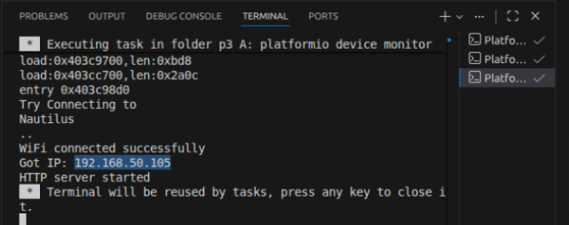
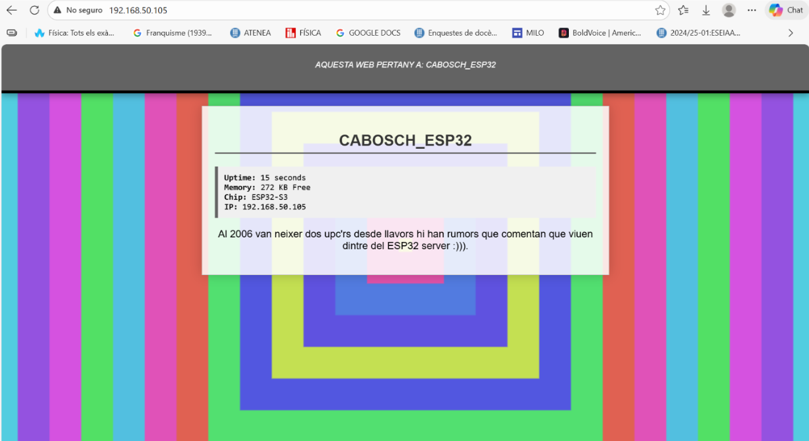
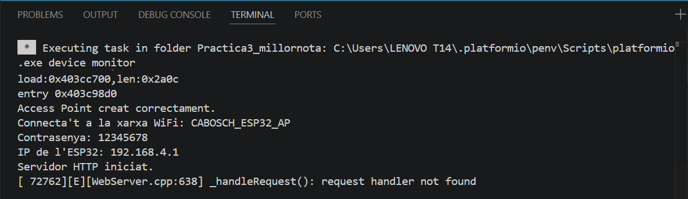

# PRÀCTICA 3: WiFi i Bluetooth

**Alumne:** Martí Cabanes  
---

## Objectiu

L’objectiu d’aquesta pràctica és entendre el funcionament bàsic del WiFi i del Bluetooth amb una ESP32.

En aquesta pràctica hem realitzat la **Part A**, que consisteix a crear una pàgina web amb l’ESP32. També hem realitzat l’**exercici de millora de nota**, que consisteix a fer el mateix exercici WiFi però utilitzant el mode **AP** en lloc del mode **STA**.

La part de Bluetooth no s’ha realitzat perquè la placa utilitzada és una **ESP32-S3**, i aquesta placa no és compatible amb el Bluetooth Classic utilitzat per la llibreria `BluetoothSerial.h`.

---

# Part A: Generació d’una pàgina web en mode STA

## Funcionament

En aquesta part hem creat un servidor web amb l’ESP32 en mode **STA**.

Això vol dir que l’ESP32 es connecta a una xarxa WiFi existent. Quan la connexió és correcta, el monitor sèrie mostra la IP assignada a la placa. Després, introduint aquesta IP al navegador, es pot veure la pàgina web generada per l’ESP32.

El funcionament general és:

1. L’ESP32 inicia la comunicació sèrie.
2. Es connecta a una xarxa WiFi existent.
3. Mostra la IP pel monitor sèrie.
4. Inicia el servidor web.
5. El navegador accedeix a la pàgina mitjançant la IP de l’ESP32.

---

## Sortida pel monitor sèrie

En el monitor sèrie es pot veure que l’ESP32 es connecta correctament a la xarxa WiFi i mostra la IP que s’ha d’utilitzar al navegador.



---

## Visualització de la pàgina web

Un cop introduïda la IP al navegador, es pot veure la pàgina web creada.



La pàgina web s’ha modificat respecte a l’exemple inicial de la pràctica. S’ha afegit una capçalera personalitzada, informació de l’ESP32 i un fons animat amb colors.

La web mostra:

- Temps d’activitat de l’ESP32.
- Memòria lliure.
- Model del xip.
- IP de l’ESP32.

---

## Fitxer HTML

L’enunciat també demana incloure un fitxer addicional que només contingui la pàgina HTML. Per això s’ha creat el fitxer:

```text
pagina.html
```

Aquest fitxer conté només el codi HTML, CSS i JavaScript de la pàgina web, sense el codi Arduino.

---

## Codi complet Part A - Mode STA

```cpp
#include <Arduino.h>
#include <WiFi.h>
#include <WebServer.h>

// --- CONFIGURACIÓN DE RED ---
const char* ssid = "Nautilus"; 
const char* password = "20000Leguas"; 

WebServer server(80);

String getHTML() {
  String html = "<!DOCTYPE html><html lang='en-US'>";
  html += "<head><meta charset='UTF-8'><meta name='viewport' content='width=device-width, initial-scale=1.0'>";
  html += "<title>Ever Dream This ESP32?</title>";
  
  html += "<style>";
  html += "body { margin: 0; overflow-x: hidden; background: #fff; font-family: 'Open Sans', sans-serif; text-align: center; }";
  html += "#falling-canvas { position: fixed; top: 0; left: 0; width: 100%; height: 100%; z-index: -1; }";
  
  html += ".header-thisman { background: #636363; color: #ffffff; padding: 20px; border-bottom: 5px solid #000; box-shadow: 0 4px 10px rgba(0,0,0,0.3); }";
  html += ".site-title { font-size: 2em; text-transform: uppercase; margin: 0; letter-spacing: 2px; }";
  html += ".site-description { font-size: 0.8em; font-style: italic; margin-top: 5px; }";
  
  html += ".main-content { background: rgba(255, 255, 255, 0.85); max-width: 600px; margin: 20px auto; padding: 20px; border: 1px solid #ccc; box-shadow: 0 0 20px rgba(0,0,0,0.2); }";
  html += ".portrait { width: 150px; height: auto; border: 4px solid #000; margin: 15px; transition: transform 0.3s; }";
  html += ".portrait:hover { transform: scale(1.1) rotate(5deg); }";
  
  html += ".esp-data { background: #f0f0f0; border-left: 5px solid #636363; padding: 10px; text-align: left; margin: 10px 0; font-family: monospace; }";
  html += "h2 { color: #333; border-bottom: 2px solid #636363; padding-bottom: 5px; }";
  html += "</style></head><body>";

  html += "<canvas id='falling-canvas'></canvas>";

  html += "<div class='header-thisman'>";
  html += "  <p class='site-description'>AQUESTA WEB PERTANY A: CABOSCH_ESP32</p>";
  html += "</div>";

  html += "<div class='main-content'>";
  html += "  <h2>CABOSCH_ESP32</h2>";
  
  html += "  <div class='esp-data'>";
  html += "    <strong>Uptime:</strong> " + String(millis() / 1000) + " seconds<br>";
  html += "    <strong>Memory:</strong> " + String(ESP.getFreeHeap() / 1024) + " KB Free<br>";
  html += "    <strong>Chip:</strong> " + String(ESP.getChipModel()) + "<br>";
  html += "    <strong>IP:</strong> " + WiFi.localIP().toString();
  html += "  </div>";
  
  html += "  <p>Al 2006 van neixer dos upc'rs desde llavors hi han rumors que comentan que viuen dintre del ESP32 server :))).</p>";
  html += "</div>";

  html += "<script>";
  html += "const canvas = document.getElementById('falling-canvas');";
  html += "const ctx = canvas.getContext('2d');";
  html += "let w, h, colors = [];";
  html += "function init() {";
  html += "  w = window.innerWidth; h = window.innerHeight;";
  html += "  canvas.width = w; canvas.height = h;";
  html += "  colors = [];";
  html += "  for(let i=0; i<15; i++) colors.push(`hsl(${Math.random()*360}, 70%, 60%)`);";
  html += "}";
  html += "let offset = 0;";
  html += "function draw() {";
  html += "  offset += 1.5;";
  html += "  if (offset > 100) { offset = 0; colors.unshift(`hsl(${Math.random()*360}, 70%, 60%)`); colors.pop(); }";
  html += "  for(let i=colors.length-1; i>=0; i--) {";
  html += "    ctx.fillStyle = colors[i];";
  html += "    let size = (i * 100) + offset;";
  html += "    ctx.fillRect(w/2 - size/2, h/2 - size/2, size, size);";
  html += "  }";
  html += "  requestAnimationFrame(draw);";
  html += "}";
  html += "window.onresize = init; init(); draw();";
  html += "</script></body></html>";
  
  return html;
}

void handle_root() {
  server.send(200, "text/html", getHTML());
}

void setup() {
  Serial.begin(115200);
  WiFi.begin(ssid, password);
  
  Serial.print("Conectando a la red de los sueños...");
  while (WiFi.status() != WL_CONNECTED) {
    delay(500);
    Serial.print(".");
  }
  
  Serial.println("\nConexión establecida.");
  Serial.print("Busca esta IP en tu navegador: ");
  Serial.println(WiFi.localIP());

  server.on("/", handle_root);
  server.begin();

  Serial.println("Servidor HTTP iniciat.");
}

void loop() {
  server.handleClient();
}
```

---

## Diagrama de flux Part A

El següent diagrama mostra el funcionament general de la Part A.


En aquest diagrama es pot veure com l’ESP32 intenta connectar-se a una xarxa WiFi existent. Si encara no està connectada, continua esperant. Quan la connexió és correcta, mostra la IP i inicia el servidor web.

---

# Part B: Bluetooth

La part B de la pràctica demana fer una comunicació Bluetooth amb el mòbil utilitzant la llibreria:

```cpp
#include "BluetoothSerial.h"
```

En el nostre cas, aquesta part no s’ha pogut realitzar perquè la placa utilitzada és una **ESP32-S3**. Aquesta placa no suporta Bluetooth Classic SPP, que és el tipus de Bluetooth que utilitza `BluetoothSerial.h`.

---

# Exercici de millora de nota: WiFi en mode AP

## Funcionament

L’exercici de millora consisteix a fer el mateix exercici WiFi, però en comptes d’utilitzar el mode **STA**, utilitzar el mode **AP**.

En mode STA, l’ESP32 es connecta a una xarxa WiFi existent.

En mode AP, l’ESP32 crea la seva pròpia xarxa WiFi. Així no cal tenir un router extern per accedir a la pàgina web.

---

## Diferència entre STA i AP

| Mode | Funcionament | Necessita xarxa externa? |
|---|---|---|
| STA | L’ESP32 es connecta a una WiFi existent | Sí |
| AP | L’ESP32 crea la seva pròpia WiFi | No |

---

## Configuració AP

En aquesta part, l’ESP32 crea una xarxa WiFi amb el nom:

```text
CABOSCH_ESP32_AP
```

La contrasenya és:

```text
12345678
```

Un cop connectat l’ordinador o el mòbil a aquesta xarxa, es pot accedir a la pàgina web amb la IP:

```text
192.168.4.1
```

---

## Sortida pel monitor sèrie AP

En el monitor sèrie es pot veure que l’Access Point s’ha creat correctament, juntament amb el nom de la xarxa, la contrasenya i la IP.



El missatge:

```text
request handler not found
```

pot aparèixer perquè el navegador intenta carregar alguna ruta extra, com per exemple `/favicon.ico`. Això no afecta el funcionament de la web principal.

---

## Visualització de la pàgina web en mode AP

Després de connectar-se a la xarxa creada per l’ESP32, s’accedeix a la pàgina web des del navegador.


La pàgina és la mateixa que a la Part A, però ara funciona sense connectar-se a una xarxa WiFi externa.

---

## Codi complet Millora - Mode AP

```cpp
#include <Arduino.h>
#include <WiFi.h>
#include <WebServer.h>

// --- CONFIGURACIÓN DE RED EN MODO AP ---
const char* ssid = "CABOSCH_ESP32_AP";
const char* password = "12345678";

WebServer server(80);

String getHTML() {
  String html = "<!DOCTYPE html><html lang='en-US'>";
  html += "<head><meta charset='UTF-8'><meta name='viewport' content='width=device-width, initial-scale=1.0'>";
  html += "<title>Ever Dream This ESP32?</title>";
  
  html += "<style>";
  html += "body { margin: 0; overflow-x: hidden; background: #fff; font-family: 'Open Sans', sans-serif; text-align: center; }";
  html += "#falling-canvas { position: fixed; top: 0; left: 0; width: 100%; height: 100%; z-index: -1; }";
  
  html += ".header-thisman { background: #636363; color: #ffffff; padding: 20px; border-bottom: 5px solid #000; box-shadow: 0 4px 10px rgba(0,0,0,0.3); }";
  html += ".site-title { font-size: 2em; text-transform: uppercase; margin: 0; letter-spacing: 2px; }";
  html += ".site-description { font-size: 0.8em; font-style: italic; margin-top: 5px; }";
  
  html += ".main-content { background: rgba(255, 255, 255, 0.85); max-width: 600px; margin: 20px auto; padding: 20px; border: 1px solid #ccc; box-shadow: 0 0 20px rgba(0,0,0,0.2); }";
  html += ".portrait { width: 150px; height: auto; border: 4px solid #000; margin: 15px; transition: transform 0.3s; }";
  html += ".portrait:hover { transform: scale(1.1) rotate(5deg); }";
  
  html += ".esp-data { background: #f0f0f0; border-left: 5px solid #636363; padding: 10px; text-align: left; margin: 10px 0; font-family: monospace; }";
  html += "h2 { color: #333; border-bottom: 2px solid #636363; padding-bottom: 5px; }";
  html += "</style></head><body>";

  html += "<canvas id='falling-canvas'></canvas>";

  html += "<div class='header-thisman'>";
  html += "  <p class='site-description'>AQUESTA WEB PERTANY A: CABOSCH_ESP32</p>";
  html += "</div>";

  html += "<div class='main-content'>";
  html += "  <h2>CABOSCH_ESP32</h2>";
  
  html += "  <div class='esp-data'>";
  html += "    <strong>Uptime:</strong> " + String(millis() / 1000) + " seconds<br>";
  html += "    <strong>Memory:</strong> " + String(ESP.getFreeHeap() / 1024) + " KB Free<br>";
  html += "    <strong>Chip:</strong> " + String(ESP.getChipModel()) + "<br>";
  html += "    <strong>AP IP:</strong> " + WiFi.softAPIP().toString();
  html += "  </div>";
  
  html += "  <p>Al 2006 van neixer dos upc'rs desde llavors hi han rumors que comentan que viuen dintre del ESP32 server :))).</p>";
  html += "</div>";

  html += "<script>";
  html += "const canvas = document.getElementById('falling-canvas');";
  html += "const ctx = canvas.getContext('2d');";
  html += "let w, h, colors = [];";
  html += "function init() {";
  html += "  w = window.innerWidth; h = window.innerHeight;";
  html += "  canvas.width = w; canvas.height = h;";
  html += "  colors = [];";
  html += "  for(let i=0; i<15; i++) colors.push(`hsl(${Math.random()*360}, 70%, 60%)`);";
  html += "}";
  html += "let offset = 0;";
  html += "function draw() {";
  html += "  offset += 1.5;";
  html += "  if (offset > 100) { offset = 0; colors.unshift(`hsl(${Math.random()*360}, 70%, 60%)`); colors.pop(); }";
  html += "  for(let i=colors.length-1; i>=0; i--) {";
  html += "    ctx.fillStyle = colors[i];";
  html += "    let size = (i * 100) + offset;";
  html += "    ctx.fillRect(w/2 - size/2, h/2 - size/2, size, size);";
  html += "  }";
  html += "  requestAnimationFrame(draw);";
  html += "}";
  html += "window.onresize = init; init(); draw();";
  html += "</script></body></html>";
  
  return html;
}

void handle_root() {
  server.send(200, "text/html", getHTML());
}

void setup() {
  Serial.begin(115200);

  WiFi.softAP(ssid, password);

  Serial.println("Access Point creat correctament.");
  Serial.print("Connecta't a la xarxa WiFi: ");
  Serial.println(ssid);
  Serial.print("Contrasenya: ");
  Serial.println(password);
  Serial.print("IP de l'ESP32: ");
  Serial.println(WiFi.softAPIP());

  server.on("/", handle_root);
  server.begin();

  Serial.println("Servidor HTTP iniciat.");
}

void loop() {
  server.handleClient();
}
```

---

## Diagrama de flux AP

El següent diagrama mostra el funcionament del mode AP.


Aquest diagrama és més simple que el de la Part A, perquè en mode AP l’ESP32 no ha d’esperar a connectar-se a cap xarxa externa. Directament crea la seva pròpia WiFi i inicia el servidor web.

---

# Conclusions

En aquesta pràctica hem creat un servidor web amb l’ESP32.

Primer s’ha fet en mode STA, connectant l’ESP32 a una xarxa WiFi existent i accedint a la web mitjançant la IP mostrada pel monitor sèrie.

Després s’ha fet la millora de nota en mode AP, on l’ESP32 crea la seva pròpia xarxa WiFi i permet accedir a la mateixa pàgina web sense necessitat d’un router extern.

La part de Bluetooth Classic no s’ha pogut realitzar perquè la placa ESP32-S3 no suporta `BluetoothSerial.h`.

Amb aquesta pràctica hem pogut veure la diferència entre els modes WiFi STA i AP, i com una ESP32 pot funcionar com a servidor web.
